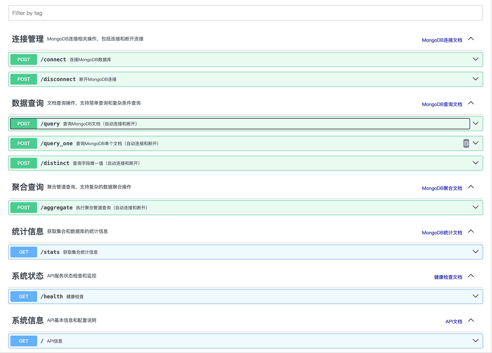
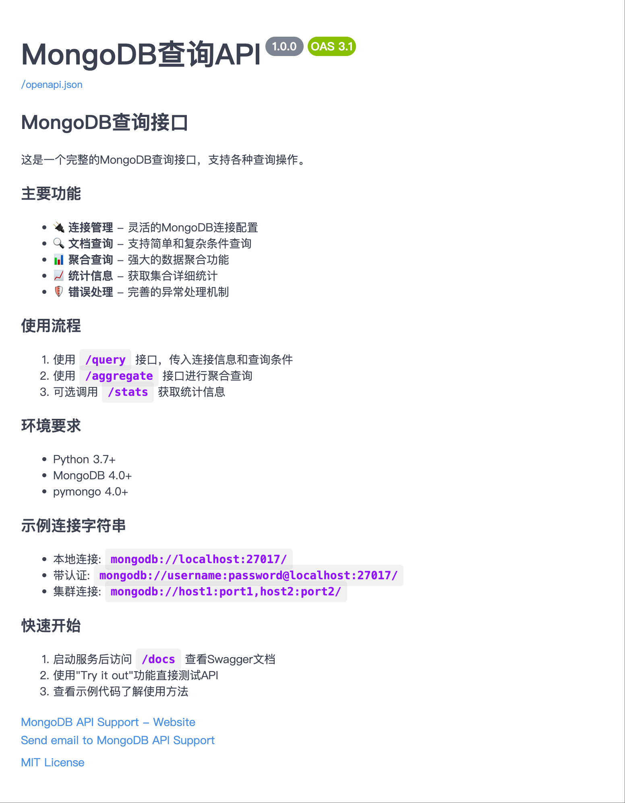

[🇨🇳 中文文档 | Chinese README](./README.zh-CN.md)

# MongoDB Query API

A complete Python MongoDB query API, supporting both direct API calls and HTTP RESTful API, with built-in optimized Swagger UI documentation.

## Features

- 🔌 **Flexible Connection Management** - Custom MongoDB connection string support
- 🔍 **Powerful Query** - Supports simple, complex, and aggregation queries
- 🎯 **Single Document Query** - Supports query_one to get a single document
- 🎯 **Distinct Query** - Supports distinct to get unique field values
- 📊 **Statistics** - Get collection statistics
- 🌐 **HTTP API** - RESTful API interface
- 📚 **Swagger Docs** - Built-in Swagger UI for online testing
- 🛡️ **Error Handling** - Robust error and exception handling
- 📝 **Logging** - Detailed operation logs
- 🔄 **Connection Pool** - Automatic connection management and resource release
- ⚡ **Auto Connect/Disconnect** - New API supports auto connect/disconnect
- 🔄 **Force Refresh Cache** - Force data refresh from DB
- 🛡️ **Redis Fallback** - Redis errors will not affect core features

## Project Screenshots

### API Documentation Interface


### Swagger UI Interface


## GitHub Stats


## Installation

```bash
pip install -r requirements.txt
```

## Project Structure

```
python-mongodb-api/
├── mongodb_api.py          # Core MongoDB query API class
├── fastapi_mongodb.py      # FastAPI HTTP interface
├── swagger_config.py       # Swagger UI config
├── start_api.py            # Startup script
├── example_usage.py        # Usage examples
├── config.py               # Config file
├── requirements.txt        # Dependencies
└── README.md               # Project documentation
```

## Quick Start

### 1. Start the API Service

#### Using the Startup Script (Recommended)
```bash
python start_api.py
python start_api.py --reload
python start_api.py --port 8080
python start_api.py --log-level debug
```

#### Directly Start
```bash
python fastapi_mongodb.py
```

### 2. Access Swagger Docs

After starting, visit:
- **Swagger UI**: http://localhost:8000/docs
- **ReDoc**: http://localhost:8000/redoc
- **Health Check**: http://localhost:8000/health

### 3. Use Swagger UI
1. Open http://localhost:8000/docs
2. View API docs and examples
3. Use "Try it out" to test APIs
4. See request/response samples

### 4. API Usage

#### New API (Recommended) - Auto Connect/Disconnect
```python
import requests

# Query API
response = requests.post("http://localhost:8000/query", json={
    "connection_string": "mongodb://localhost:27017/",
    "database_name": "test_db",
    "collection_name": "users",
    "query_filter": {"age": {"$gte": 25}},
    "projection": {"name": 1, "age": 1, "email": 1, "_id": 0},
    "sort": [["age", -1]],
    "limit": 10
})

# Force refresh cache
response = requests.post("http://localhost:8000/query", json={
    "connection_string": "mongodb://localhost:27017/",
    "database_name": "test_db",
    "collection_name": "users",
    "query_filter": {"age": {"$gte": 25}},
    "force_refresh": True
})

# Aggregation query
response = requests.post("http://localhost:8000/aggregate", json={
    "connection_string": "mongodb://localhost:27017/",
    "database_name": "test_db",
    "collection_name": "users",
    "pipeline": [
        {"$match": {"age": {"$gte": 25}}},
        {"$group": {"_id": "$department", "count": {"$sum": 1}}}
    ]
})
```

#### Old API - Manual Connect/Disconnect
```python
import requests

# 1. Connect
response = requests.post("http://localhost:8000/connect", json={
    "connection_string": "mongodb://localhost:27017/",
    "database_name": "test_db",
    "collection_name": "users"
})

# 2. Query
response = requests.post("http://localhost:8000/query", json={
    "query_filter": {"age": {"$gte": 25}},
    "projection": {"name": 1, "age": 1, "email": 1, "_id": 0},
    "sort": [["age", -1]],
    "limit": 5
})

# 3. Disconnect
response = requests.post("http://localhost:8000/disconnect")
```

### 5. Use API Class Directly
```python
from mongodb_api import MongoDBQueryAPI

api = MongoDBQueryAPI()
api.connect_to_mongodb(
    connection_string="mongodb://localhost:27017/",
    database_name="test_db",
    collection_name="users"
)

query_result = api.query_documents(
    query_filter={"age": {"$gte": 25}},
    projection={"name": 1, "age": 1, "email": 1, "_id": 0},
    sort=[("age", -1)],
    limit=5
)

api.close_connection()
```

## API Endpoints

### Data Query (New API)
- `POST /query` - Query documents (auto connect/disconnect)
- `POST /query_one` - Query a single document (auto connect/disconnect)
- `POST /aggregate` - Aggregation query (auto connect/disconnect)
- `POST /distinct` - Distinct field values (auto connect/disconnect)

### Connection Management (Old API)
- `POST /connect` - Connect to MongoDB
- `POST /disconnect` - Disconnect

### Statistics
- `GET /stats` - Get collection stats

### System
- `GET /health` - Health check
- `GET /` - API info

## More
For full documentation, advanced usage, error handling, and more, please refer to the [Chinese README](./README.zh-CN.md). 